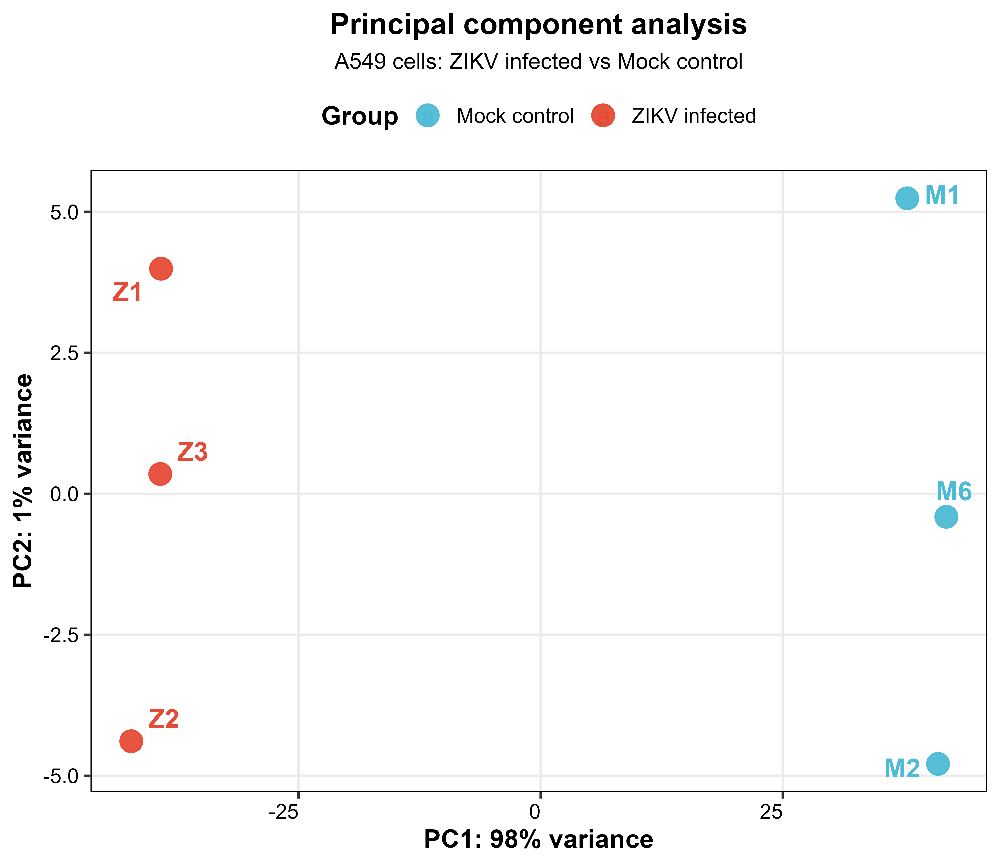
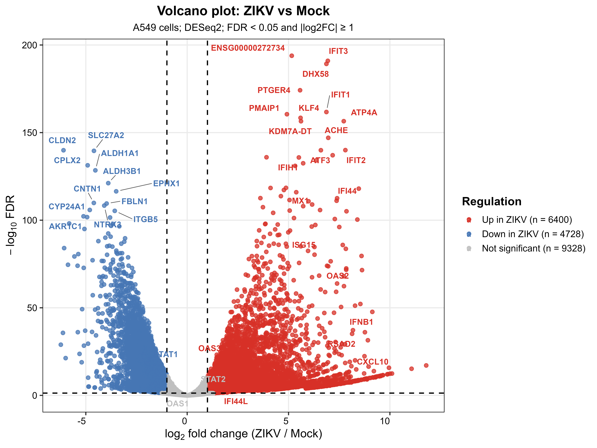
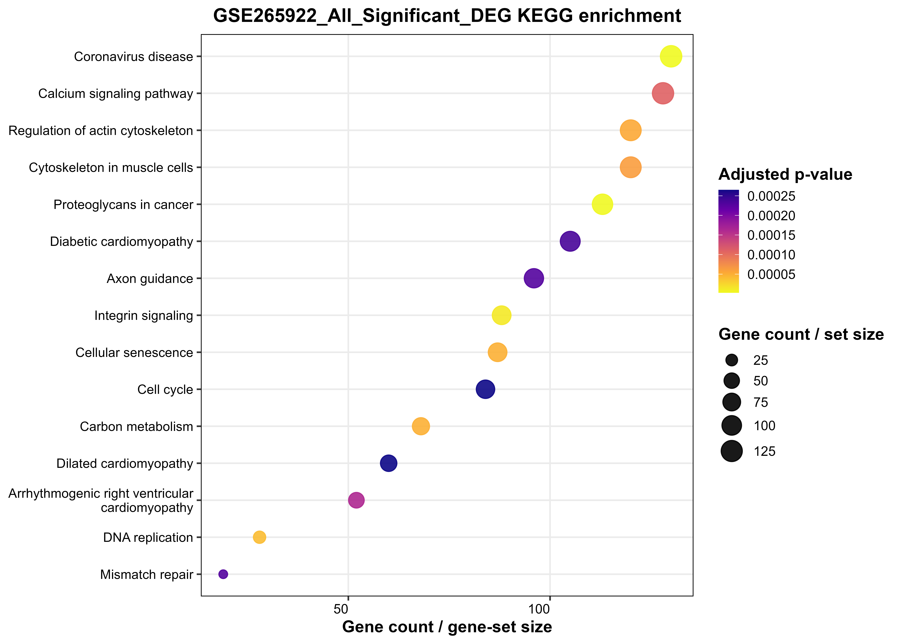

<div align="center">
  <h1>🧬 Zika Virus RNA-seq Meta-Analysis</h1>
  <p><strong>A comprehensive, reproducible pipeline for analyzing transcriptional responses to ZIKV infection in A549 cells.</strong></p>

  
  
  
  
</div>

<br>

## 📖 Overview

This repository contains a modular and unified Bioinformatics pipeline for investigating the host cellular response to Zika Virus (ZIKV). The analysis integrates independent transcriptomic datasets using a meta-analysis approach to correct for batch effects and isolate high-confidence Differentially Expressed Genes (DEGs) and perturbed pathways.

---

## 📊 Key Results (GSE265922)

### Principal Component Analysis (PCA)
*Strong biological separation between ZIKV-infected and Mock samples.*
<p align="center">
  
</p>

### Differential Expression Volcano Plot
*Identification of significantly upregulated and downregulated genes during infection (ZIKV vs Mock).*
<p align="center">
  
</p>

### KEGG Pathway Enrichment
*Pathways perturbed by ZIKV infection, emphasizing innate immune and viral responses.*
<p align="center">
  
</p>

---

## 🧬 Datasets

This meta-analysis leverages two publicly available datasets from NCBI GEO:

| GEO Accession | Cell Line | Condition | Input Source |
| :--- | :--- | :--- | :--- |
| **[GSE146423](https://www.ncbi.nlm.nih.gov/geo/query/acc.cgi?acc=GSE146423)** | A549 | ZIKV vs Control | NCBI Gene Counts |
| **[GSE265922](https://www.ncbi.nlm.nih.gov/geo/query/acc.cgi?acc=GSE265922)** | A549 | ZIKV vs Mock | STAR Unstranded Reads |

---

## 🏗️ Project Architecture

The pipeline is built strictly applying DRY (Don't Repeat Yourself) principles. Shared helper functions and plotting aesthetics are globally defined, making individual dataset analysis scripts lightweight and readable.

```text
📦 Zika_virus_RNA_seq
 ┣ 📂 R/
 ┃ ┣ 📜 utils.R               # Universal data handling & renv utilities
 ┃ ┗ 📜 plot_functions.R      # ggplot2 publication-ready themes and save wrappers
 ┣ 📂 GSE146423/
 ┃ ┗ 📜 DEG_GSE146423.R       # Standalone pipeline for GSE146423
 ┣ 📂 GSE265922/
 ┃ ┗ 📜 DEG_GES265922.R       # Standalone pipeline for GSE265922
 ┣ 📂 Meta_Analysis/
 ┃ ┗ 📜 Meta_Analysis.R       # The unified batch-corrected DESeq2 meta-analysis
 ┣ 📂 assets/                 # Preview graphics for README
 ┣ 📜 setup_renv.R            # 1-click dependency bootstrapper
 ┗ 📜 Zika_virus_wetlab.Rproj # RStudio portable project file
```

---

## 🚀 Quick Start & Reproducibility

This project uses `renv` to guarantee the exact package versions used during the original analysis. You can clone this repository and reproduce it anywhere (Mac, Windows, Linux) without worrying about broken dependencies.

1. **Clone the repository:**
   ```bash
   git clone https://github.com/JaykishanJ/Zika_virus_RNA_seq.git
   cd Zika_virus_RNA_seq
   ```
2. **Open the R Project:**
   Open `Zika_virus_wetlab.Rproj` in RStudio.
3. **Initialize the Environment:**
   Run the bootstrapping script to restore packages:
   ```R
   source("setup_renv.R")
   ```
4. **Execute the pipelines:**
   - For individual analyses, source `GSE146423/DEG_GSE146423.R` or `GSE265922/DEG_GES265922.R`.
   - For the joint Meta-Analysis, run `Meta_Analysis/Meta_Analysis.R`.

Outputs (QC plots, Count Matrices, Significant DEGs, and GSEA graphics) will automatically generate into cleanly isolated `Results/` folders within each respective directory!

---

## 📝 Acknowledgments

* Analysis conceptualized and executed using R, DESeq2, and clusterProfiler.
* Visualizations generated via ggplot2 and EnhancedVolcano.
